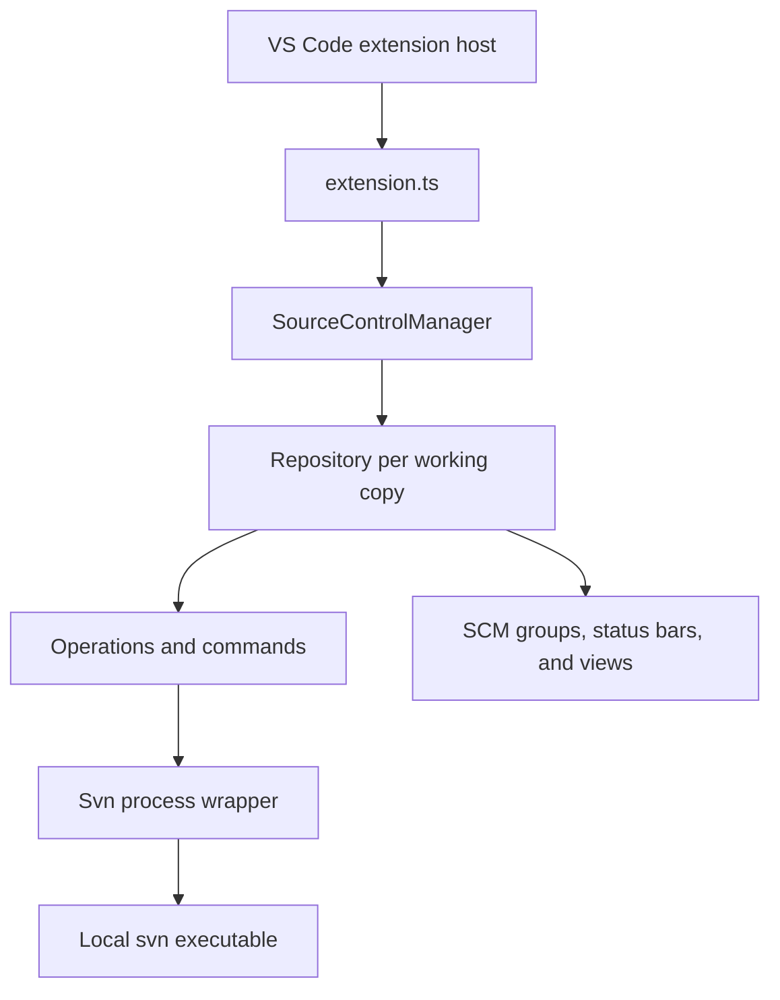

# Architecture

## Overview

The extension is an adapter between VS Code's Source Control API and the local
Subversion command-line client. It does not implement the SVN protocol and does
not include an SVN binary.

The companion [design principles](design-principles.md) explain why these
boundaries exist and define the guardrails for changing them.

## Activation

`src/extension.ts` is the composition root. Activation:

1. creates the SVN output channel and registers configuration;
2. registers the `tempsvnfs:` and `svn:` file-system providers before
   asynchronous SVN discovery, so restored editors can resolve their URIs;
3. locates the configured or system `svn` executable;
4. constructs `Svn` and an owned, not-yet-enabled `SourceControlManager`;
5. registers commands and refresh helpers;
6. awaits the owned manager's initial repository discovery;
7. constructs views and contexts against the discovered model, then commits
   readiness only after these acquisitions succeed.

Activation uses explicit disposable scopes. Every successful acquisition is
recorded immediately; failure unwinds resources in reverse order, even if one
cleanup throws. Manager ownership begins before its first asynchronous scan.
The `svn:` provider and manager command share one readiness promise, which is
resolved only after the whole initialization transaction succeeds. Disposal or
fatal initialization failure rejects pending consumers and rolls back the scope.

Missing-SVN recovery keeps only the bootstrap output/configuration/filesystem
resources alive while the user chooses another executable. Failed attempts are
rolled back independently; declining recovery rejects restored reads with an
unavailable error. Bootstrap resources remain activation-owned until disposal.
View constructors register resources one at a time with constructor-local
rollback, so a later command-registration failure cannot leak an earlier view.
The commit-message test command is registered explicitly only in extension test
mode and is disposed with the successful activation; importing modules does not
register that command.

The extension activates after startup and when VS Code needs an `svn:` URI.

## Core components

### `Svn`

`src/svn.ts` owns child-process execution, output decoding, command logging,
and conversion of command failures into `SvnError`. Repository-aware logic
should not be added to this layer unless it is required to execute a command.

Text-log search uses the same configured executor, credentials, non-interactive
arguments, environment and error classification as other SVN commands. It is an
explicit user-triggered network operation, logged as `log-search`; it does not
run from local status or editor events. `Svn.exec` can deliver decoded stdout
chunks while retaining its normal completion result. Streaming uses the explicit
encoding or `svn.default.encoding` (UTF-8 fallback), with a stateful decoder so
split multibyte characters survive. Buffered calls retain automatic detection.

The common process runner settles only after the child and its pipes close and
removes cancellation/listener resources on success, failure and cancellation.
Cancellation terminates the child and is distinct from an SVN failure.
`Repository` owns authentication retries and resets the search snapshot on each
attempt. The command awaits progress and owns the single writer for
`tempsvnfs:/svn.log`: a new search cancels the previous one, and closing the
document or disposing the command/repository cancels active work.

Authentication waits also observe the search's cancellation signal. A cancelled
caller stops waiting for secret storage immediately; late results are ignored.
The owner of an authentication prompt cancels both input boxes and releases the
shared prompt slot. Other callers can request a fresh prompt, and a late result
from the cancelled prompt cannot overwrite credentials.

### `SourceControlManager`

`src/source_control_manager.ts` discovers SVN working copies in workspace
folders, opens and closes repositories, routes file events to the appropriate
repository, and publishes repository lifecycle events.

Detailed rules and invariants are documented in
[Repository discovery and routing](repository-discovery.md).

One workspace may contain several working copies. Repository routing therefore
must use the most specific matching working-copy root and must remain safe for
multi-root workspaces.

### `Repository`

`src/repository.ts` represents one opened workspace projection of a working copy
in the VS Code Source Control API. It owns resource groups, status refreshes,
operations, authentication, watchers, remote-change polling, and
projection-specific UI state. Several sibling workspace folders may share one
physical SVN root while retaining separate SCM projections.

`src/operationsImpl.ts` tracks operation concurrency. Files in `src/commands/`
translate VS Code commands into repository operations.

### Views and virtual file systems

- `src/historyView/` implements repository, file, and branch history views.
  Avatar URIs are derived from the current URL template, author and requested
  size on each render, without a global URI cache. Changing avatar settings
  takes effect on the next render; it does not itself force a history reload.
- `src/svnFileSystemProvider.ts` serves repository content through `svn:` URIs,
  primarily for diffs and restored editors.
- `src/temp_svn_fs.ts` serves temporary history content through `tempsvnfs:`.
- `src/resource.ts` maps SVN file states to VS Code SCM resources.
- `src/statusbar/`, `src/contexts/`, and `src/treeView/` provide supporting UI.

## Refresh and event flow

Workspace and repository file watchers trigger debounced status work. A status
refresh executes `svn status`, parses its XML output, and updates the repository
resource groups. Targeted operations can request narrower refreshes, while a
full refresh remains the correctness fallback.

The full model is documented in
[Status and refresh model](status-and-refresh.md).

Remote status checks and history queries are separate from local status
refreshes because they may contact the server and have different latency.
Command log reasons in `src/svnLogReasons.ts` make these paths visible in the
SVN output channel.

The important invariant is that VS Code resource groups are projections of SVN
status, not an independent source of truth. File-system events schedule work;
they do not by themselves prove an SVN state transition.

## Ownership and disposal

The object that creates a listener, timer, watcher, provider, or child component
owns its disposal. Activation-level resources are collected by `extension.ts`;
manager-level and repository-level resources are disposed with their owners.

Debounced callbacks are also lifecycle resources. Classes using `@debounce`
must call `cancelDebounces(this)` when disabled or disposed so callbacks cannot
run against stale state. Disposal must be safe when activation or initialization
has only partially completed.

## Architectural boundaries

- `Svn` executes and normalizes commands; it does not own VS Code UI state.
- `SourceControlManager` discovers and routes repositories; it does not own the
  detailed status model of an individual workspace projection.
- `Repository` owns one opened workspace projection; features scoped to the
  physical working-copy root coordinate sibling projections explicitly, and
  views do not keep a competing copy of that state.
- Commands coordinate user actions through the repository instead of spawning
  SVN processes directly.
- Parsers convert SVN output into typed data and should remain independent of UI
  behavior.
- File-system providers expose document content but do not become persistent
  storage or a repository-state authority.

Crossing one of these boundaries should be treated as an architecture change,
not as a local refactor.

`src/statusSnapshot.ts` owns the optional workspace-scoped startup snapshot,
validation and bounded target selection. `Repository` applies restored and live
records through one SCM projection function. Restoration is a display
optimization; authoritative status events, automatic actions and normal
incremental operation state remain gated on live validation. See the reopening
section in [Status and refresh](status-and-refresh.md).
