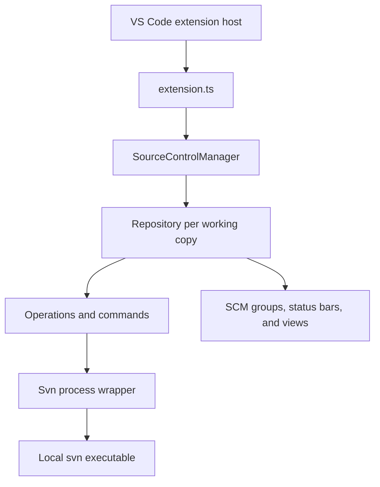

# Architecture

## Overview

The extension is an adapter between VS Code's Source Control API and the local
Subversion command-line client. It does not implement the SVN protocol and does
not include an SVN binary.

The companion [design principles](design-principles.md) explain why these
boundaries exist and define the guardrails for changing them.

## Activation

`src/extension.ts` is the composition root. Activation:

1. creates the SVN output channel and registers configuration;
2. registers the `tempsvnfs:` and `svn:` file-system providers before
   asynchronous SVN discovery, so restored editors can resolve their URIs;
3. locates the configured or system `svn` executable;
4. constructs `Svn` and `SourceControlManager`;
5. registers commands, history providers, contexts, and refresh helpers.

The extension activates after startup and when VS Code needs an `svn:` URI.

## Core components

### `Svn`

`src/svn.ts` owns child-process execution, output decoding, command logging,
and conversion of command failures into `SvnError`. Repository-aware logic
should not be added to this layer unless it is required to execute a command.

### `SourceControlManager`

`src/source_control_manager.ts` discovers SVN working copies in workspace
folders, opens and closes repositories, routes file events to the appropriate
repository, and publishes repository lifecycle events.

One workspace may contain several working copies. Repository routing therefore
must use the most specific matching working-copy root and must remain safe for
multi-root workspaces.

### `Repository`

`src/repository.ts` represents one working copy in the VS Code Source Control
API. It owns resource groups, status refreshes, operations, authentication,
watchers, remote-change polling, and repository-specific UI state.

`src/operationsImpl.ts` tracks operation concurrency. Files in `src/commands/`
translate VS Code commands into repository operations.

### Views and virtual file systems

- `src/historyView/` implements repository, file, and branch history views.
- `src/svnFileSystemProvider.ts` serves repository content through `svn:` URIs,
  primarily for diffs and restored editors.
- `src/temp_svn_fs.ts` serves temporary history content through `tempsvnfs:`.
- `src/resource.ts` maps SVN file states to VS Code SCM resources.
- `src/statusbar/`, `src/contexts/`, and `src/treeView/` provide supporting UI.

## Refresh and event flow

Workspace and repository file watchers trigger debounced status work. A status
refresh executes `svn status`, parses its XML output, and updates the repository
resource groups. Targeted operations can request narrower refreshes, while a
full refresh remains the correctness fallback.

Remote status checks and history queries are separate from local status
refreshes because they may contact the server and have different latency.
Command log reasons in `src/svnLogReasons.ts` make these paths visible in the
SVN output channel.

The important invariant is that VS Code resource groups are projections of SVN
status, not an independent source of truth. File-system events schedule work;
they do not by themselves prove an SVN state transition.

## Ownership and disposal

The object that creates a listener, timer, watcher, provider, or child component
owns its disposal. Activation-level resources are collected by `extension.ts`;
manager-level and repository-level resources are disposed with their owners.

Debounced callbacks are also lifecycle resources. Classes using `@debounce`
must call `cancelDebounces(this)` when disabled or disposed so callbacks cannot
run against stale state. Disposal must be safe when activation or initialization
has only partially completed.

## Architectural boundaries

- `Svn` executes and normalizes commands; it does not own VS Code UI state.
- `SourceControlManager` discovers and routes repositories; it does not own the
  detailed status model of an individual working copy.
- `Repository` owns one working copy and its SCM projection; views do not keep a
  competing copy of that state.
- Commands coordinate user actions through the repository instead of spawning
  SVN processes directly.
- Parsers convert SVN output into typed data and should remain independent of UI
  behavior.
- File-system providers expose document content but do not become persistent
  storage or a repository-state authority.

Crossing one of these boundaries should be treated as an architecture change,
not as a local refactor.
