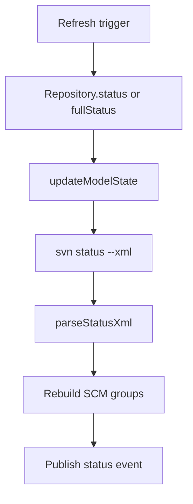

# Status and refresh model

This document describes how SVN status becomes VS Code Source Control state and
which correctness guarantees must survive performance changes.

## State ownership

`Repository` owns the visible state of one working copy:

- `changes`, `conflicts`, `unversioned`, and changelist resource groups;
- the optional `remoteChanges` group;
- ignored and external status records used for discovery and routing;
- incomplete and cleanup-required flags;
- current branch and aggregate SCM count.

These values are projections of the most recent accepted SVN status snapshot.
They are not an independent database of the working copy.

## Full status path

`Repository.updateModelState()` requests status through the lower-level SVN
repository, classifies parsed records, and then replaces the resource states.
It handles:

- file and property statuses;
- conflicts and unversioned files;
- changelists;
- ignored paths and externals;
- switched, incomplete, and locked working-copy state;
- optional repository-side status returned by `--show-updates`.

A remote status contains local working-copy status as well. When remote polling
is enabled, construction therefore performs one initial remote status instead
of an immediate local scan followed by another remote scan.

`Repository.fullStatus()` is the explicit correctness path for triggers that
invalidate how the whole snapshot is interpreted. It waits for mutating work
to become idle and tells the incremental adapter to discard queued file targets
before executing the normal full-status pipeline.
All lifecycle-owned status waiters, including full refreshes and watcher
refreshes waiting for an idle or focused window, are cancelled when their
repository is disposed. They cannot start or publish a later status operation,
and a scheduled status that reaches disposal settles without an unhandled
rejection.

## Refresh triggers

Status work can originate from:

- initial repository opening;
- an explicit refresh command;
- completion of a mutating SVN operation;
- workspace file create, change, or delete events;
- `.svn` metadata events;
- configuration changes that alter repository-wide status interpretation;
- the configured remote-status interval.

Watcher-driven work is debounced and waits until the repository is idle and the
VS Code window is focused. This combines bursts of editor and SVN file events
and avoids competing with an active operation.

`RepositoryFilesWatcher` separates ordinary workspace events from `.svn` or
`_svn` metadata events. It ignores the extension's `svn:` and `tempsvnfs:`
virtual documents and SVN temporary metadata. Repositories outside the open
workspace use a native watcher for their metadata directory when necessary.

## Targeted and incremental refresh

`enableIncrementalStatusRefresh()` installs a per-repository adapter around the
existing full-status path. The adapter keeps a status snapshot and replaces
only records belonging to known targets.

There are two targeted cases:

1. A supported mutating operation supplies its exact file or directory targets.
2. Workspace file events accumulate affected targets before the debounced
   refresh. A deleted file targets its parent because SVN may no longer accept
   the missing path itself.

For a targeted scan, `svn status --xml <targets>` is parsed and merged into the
previous snapshot. Existing records under those targets are removed before the
new records are inserted. Paths outside the targets are preserved.

Repository-wide flags such as incomplete or cleanup-required cannot be safely
recalculated from a partial scan. A targeted refresh therefore preserves them
from the previous full snapshot unless the working-copy root itself is a
target.

After a successful targeted mutation, the adapter publishes one repository-change
notification. If any normalized target is the workspace root, it first refreshes
cached `svn info`, so history consumers see the updated BASE revision. The info
cache describes the opened workspace root even when it is a subfolder of the
canonical working copy. Strict descendant mutations skip this extra command.
Relative root aliases, absolute paths, and Windows case/separator variants use
the same root comparison as repository-wide status flags. Failed mutations do
not refresh info or notify. Root mutations invalidate info before their follow-up
work. All targeted notifications then pass through `ensureInfoCurrent()`:
clean descendants need no subprocess, while descendants following a pending or
failed root refresh wait for or retry that read. A failed read leaves info dirty,
logs the error and skips notification without reporting the mutation as failed.

`SvnRepository` keeps one info cache and one serialized refresh queue. An
invalidation during a pending read rejects that result and triggers a fresh read
before publication. `updateInfo()` (startup, watcher and switch callers) uses the
same validity boundary. The owning `Repository` binds its lifecycle once, so
every queued or pending info refresh checks the same owner before execution and
cache assignment. Repository-change publication checks both liveness and cache
validity. The last accepted info remains available after failure but is not
advertised as current in a change notification.

## Full-refresh fallbacks

A full status is required when:

- no trustworthy target set is available;
- a target falls outside the working-copy root;
- `.svn` metadata changed independently of a known operation;
- a configuration change invalidates cached externals or other
  repository-wide classification;
- remote status was requested;
- targeted status execution or parsing fails.

Do not remove these fallbacks to save a command. Partial results must never
silently replace repository-wide state.

## Suppressing self-generated events

A mutating SVN command changes both working files and `.svn` metadata. Those
changes are later echoed by file watchers and could cause duplicate status
scans.

The incremental adapter suppresses this echo in two ways:

- working-copy mutation state ignores the command's own metadata events during
  the operation and for a short grace period afterward;
- snapshots of expected target files identify matching workspace events for a
  bounded period after a successful operation.

Suppression is deliberately narrow and time-bounded. An event is discarded only
when it belongs to the active targets or matches the expected post-operation
snapshot. Unrelated external changes must still schedule a refresh.

## Concurrency and publication

Operations are tracked by `OperationsImpl`. Status refresh waits for idle state,
and model updates are throttled and globally sequentialized. A mutating
operation refreshes the model before it publishes its completion event.

Resource groups should be treated as one logical projection even though VS Code
exposes them as separate mutable objects. New refresh implementations must not
publish a mixture of old and new groups as a stable result.

## Invariants for changes

- SVN output remains the behavioral authority.
- A targeted scan may replace only its covered paths.
- All accepted paths must remain inside the working-copy root.
- Remote status never uses the incremental local snapshot path.
- Unknown metadata changes force full validation.
- Repository-wide configuration changes clear pending incremental targets and
  use the explicit full-status path.
- Failed targeted work falls back to full status.
- Watcher suppression cannot hide unrelated external changes.
- Debounced and scheduled work is cancelled when its owner is disposed.
- Windows drive and UNC path comparison remains case-insensitive; other path
  behavior remains platform-correct.

Tests for this area should cover target containment, merge behavior, deletes,
rename pairs, repository-wide flags, watcher echoes, metadata fallback, failed
targeted status, and disposal.

## Reopening a working copy

A workspace-scoped `StatusSnapshotStore` saves accepted status metadata through
VS Code's Memento storage. It stores no file contents or diffs. Snapshots are
versioned and bounded to 4 MiB / 50,000 records, validated on read, and bound to
the canonical working-copy root, opened workspace scope, UUID, URL and the
administrative directory's filesystem identity. Replacement checkouts and
switches detected through that identity do not reuse the previous projection.

Startup restores that projection using the same grouping/filtering code as live
status, under ordinary SCM progress. It adds no stale-state labels or warnings.
Preview application does not publish authoritative status events or enable
automatic deletion/conflict actions. Diff navigation remains available. Commands
that build a complete commit/revert selection wait for successful live status;
mutations also wait for initial validation. Failed startup validation retains
the visible list and reports the ordinary refresh error.

For at most 50 saved changed entries, startup selects existing regular files up
to 10 MiB each and 50 MiB total, in deterministic path order. A single local
`svn stat --xml --verbose --depth empty --ignore-externals` checks them before
the full scan. Missing files, directories, rename pairs, external descendants
and oversized files retain their saved entries until full reconciliation.
Explicit clean results remove files from visible change groups; absent results
are not interpreted as clean. Only selected exact paths are replaced, preserving
other entries and remote state. Thresholds are internal starting values.

The normal initial full scan always follows, including remote status only when
configured. It explicitly resets incremental targets, seeds the normal adapter
and discovers changes outside the saved list. Fast-phase errors fall through to
that scan. Only accepted live snapshots are persisted; previews never overwrite
stored state. Disposal prevents late preview/full publication and new writes.

Preview resource objects are tracked by their repository in a weak set. A
mutation selected from the restored list re-resolves that selection after live
validation and before prompting. Restored directories (or paths whose file kind
cannot be confirmed) require reselection from the refreshed list: unchanged
properties on a directory do not prove its recursive target set is unchanged.
Ordinary live directory selections retain their existing behavior.
